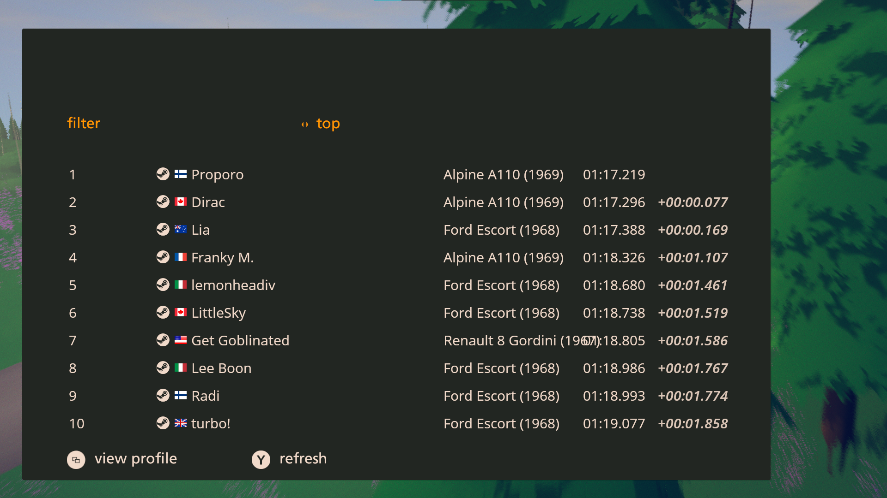

# Art Of Rally Splits

A mod for Art of Rally replacing the name of cars in menus with their real counterpart names

#### Launcher Support

#### Platform Support

## Usage

Press `CTRL + F10` to bring up the mod menu.
Click on the "Real car names" to enable/disable.
If the mod is disabled, the regular game names are displayed.
Menus displaying car names might need to get closed/refreshed to take changes into account.

## Installation

Follow the [installation guide](https://www.nexusmods.com/site/mods/21/) of
the Unity Mod Manager.
Then simply download the [latest release](https://github.com/MMike17/ArtOfRally_RealCarNames/releases/latest)
and drop it into the mod manager's mods page.

## Showcase

## Acknowledgments

- Thanks to [Theaninova](https://github.com/Theaninova) who's mods I've used as a base layer.
- Thanks to [Nexus Mod Manager](https://wiki.nexusmods.com/index.php/How_to_create_mod_for_unity_game) for the tutorial on how to make mods for UnityModManager.
- Thanks to [IGCD.net](https://igcd.net/game.php?id=1000013286) for the real names of the cars.